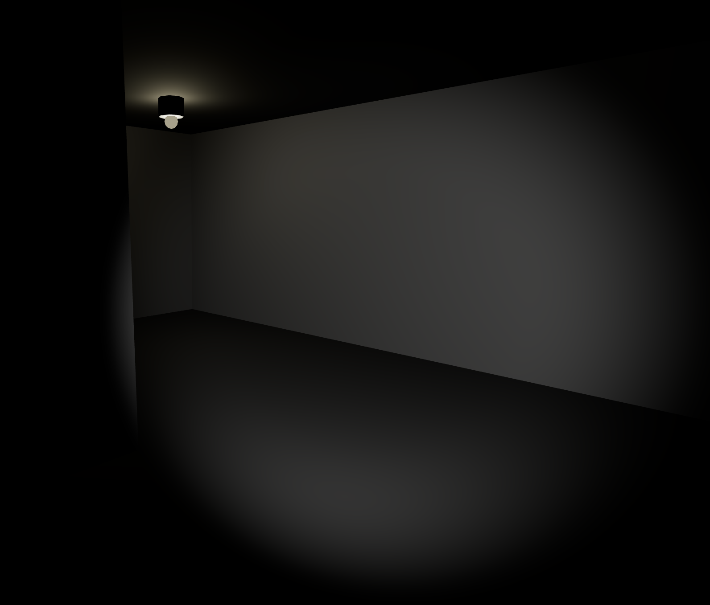

# 3D Maze Explorer

A first-person 3D maze game built with React, Three.js, and TypeScript. Navigate through procedurally generated mazes with a flashlight, discover doors that lead to other experiences, and enjoy atmospheric lighting.



## Features

### 🌟 Core Gameplay
- **First-person controls** - WASD/arrow keys for movement, mouse for looking
- **Flashlight system** - Mouse-controlled beam that follows your cursor or points forward when mouse is captured
- **Collision detection** - Proper wall collision with smooth movement
- **Atmospheric lighting** - Sparse ceiling lights with subtle flickering effects

### 🚪 Door System
- **Interactive doors** - Randomly placed doors in maze walls (10% chance per wall)
- **API integration** - Doors trigger calls to external API for multi-maze experiences
- **State persistence** - Your position and maze seed are saved when transitioning through doors
- **Return mechanism** - Come back to the same maze at your last position

### 🎲 Seeded Generation
- **Deterministic mazes** - Same seed always generates identical maze layout
- **URL-based seeds** - Pass `?seed=123` to generate specific mazes
- **Smart starting positions** - Algorithm finds open areas for better spawn points

## Getting Started

### Installation
```bash
npm install

# Copy environment configuration
cp .env.example .env

# Start development server
npm run dev
```

### Usage
- Visit `http://localhost:5173/` for a random maze
- Visit `http://localhost:5173/?seed=123` for a specific maze
- Click to capture mouse, then use WASD to move and mouse to look around
- Walk into doors to trigger transitions (currently mocked for development)

## Architecture

### Key Components

#### `App.tsx`
Main application component handling:
- URL parameter parsing for seeds
- Local storage management for maze state
- Door collision handling and API calls

#### `MazeGenerator.ts` 
Procedural maze generation using:
- Seeded random number generation for deterministic results
- Recursive backtracking algorithm for maze creation
- Smart starting position selection

#### `Maze3D.tsx`
3D maze rendering including:
- Wall geometry with proper collision boundaries  
- Door placement with visual frames
- Floor and ceiling meshes

#### `FirstPersonController.tsx`
Player movement system featuring:
- Keyboard input handling (WASD/arrows)
- Mouse look with pointer lock
- Wall collision detection
- Door interaction via raycasting

#### `Flashlight.tsx`
Dynamic lighting component:
- Mouse-following spotlight when cursor is free
- Forward-pointing light when mouse is captured
- Realistic light falloff and shadows

#### `CeilingLights.tsx`
Atmospheric lighting with:
- Sparse light placement for creepy ambiance
- Subtle flickering effects
- Smart positioning to avoid enclosed areas

### Utilities

#### `doorUtils.ts`
Door interaction system:
- Coordinate hashing for unique door identification
- Mock API implementation (replace with real endpoint)
- Local storage utilities for state persistence

## Customization

### Maze Parameters
```typescript
// In App.tsx, modify these values:
const generator = new MazeGenerator(25, 25, seed); // width, height, seed
const cellSize = 4;     // Size of each maze cell
const wallHeight = 3;   // Height of walls
```

### Door Frequency
```typescript
// In Maze3D.tsx, adjust door spawn rate:
const hasDoor = random() < 0.1; // 10% chance, change to 0.05 for 5%, etc.
```

### Lighting
```typescript
// In App.tsx, adjust ambient lighting:
<ambientLight intensity={0.05} /> // Lower = darker, higher = brighter

// In CeilingLights.tsx, modify light placement:
for (let x = 0; x < maze.length; x += 8 + Math.floor(Math.random() * 5)) {
  // Change the 8 to adjust light spacing
}
```

### Movement Speed
```typescript
// In FirstPersonController.tsx:
const moveSpeed = 5; // Adjust movement speed
```

### API Configuration
The door API can be configured via environment variables. Copy `.env.example` to `.env` and modify:

```bash
# Use mock API for offline development
VITE_USE_MOCK_DOOR_API=true

# Set your door API endpoint (used when mock is disabled)
VITE_DOOR_API_URL=https://your-api.com/door
```

**Mock API (Development):**
```bash
VITE_USE_MOCK_DOOR_API=true
```
- Returns to same domain without leaving localhost
- Simulates 500ms API delay
- Perfect for offline development

**Real API (Production):**
```bash
VITE_USE_MOCK_DOOR_API=false
VITE_DOOR_API_URL=https://backroo.ms/door
```
- Makes actual HTTP requests to your endpoint
- Handles real redirections to external sites
- Requires network connectivity

## Technical Details

### Technologies Used
- **React 18** - UI framework
- **Three.js** - 3D graphics via @react-three/fiber
- **TypeScript** - Type safety
- **Vite** - Build tool and dev server

### Performance Considerations
- Maze geometry is memoized to prevent unnecessary re-renders
- Collision detection uses efficient spatial partitioning
- Lights are strategically placed to maintain good performance
- Shadow casting is selectively disabled where not needed

### Browser Requirements
- Modern browser with WebGL support
- Pointer Lock API support for mouse capture
- Local Storage for maze state persistence

## Development Notes

### Environment Configuration
The project supports both mock and real API modes via environment variables:

- **Mock Mode** (default): Perfect for offline development, keeps you in localhost
- **Real Mode**: Makes actual API calls to your configured endpoint

### API Response Format
Your door API should return JSON with a redirect URL:
```json
{
  "redirect_url": "https://destination-site.com/",
  "url": "https://fallback-url.com/"  // fallback if redirect_url not present
}
```

### CORS Configuration
For production deployment with real API calls, ensure your API endpoint has proper CORS headers configured to allow requests from your domain.

## Contributing

When adding new features:
1. Follow the existing TypeScript patterns
2. Use proper Three.js disposal for 3D objects
3. Memoize expensive computations
4. Test with different seeds to ensure deterministic behavior

## License

MIT License - Feel free to use this as a starting point for your own maze adventures!